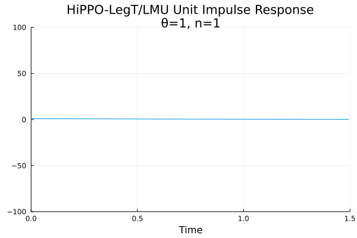
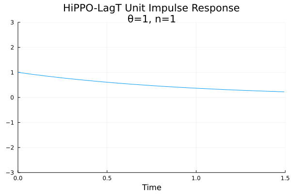
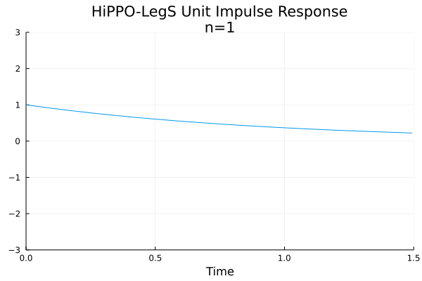
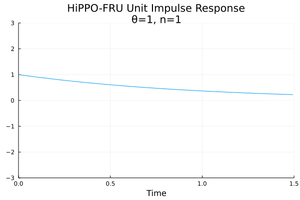
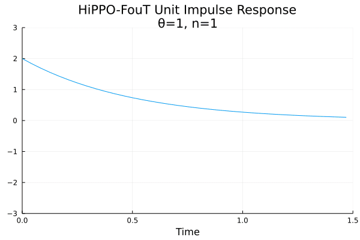
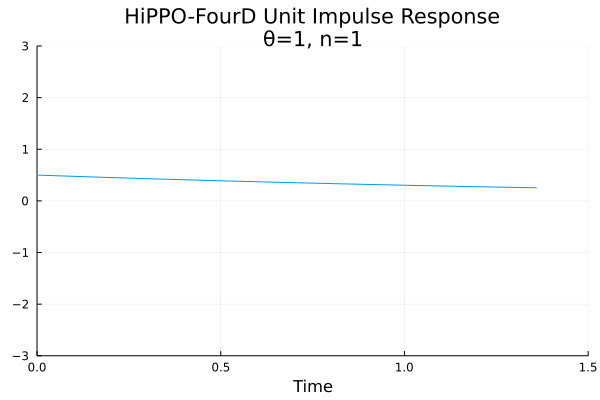
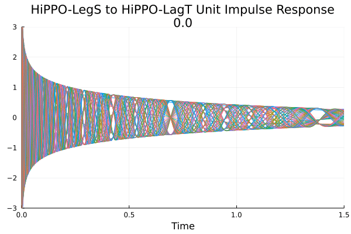
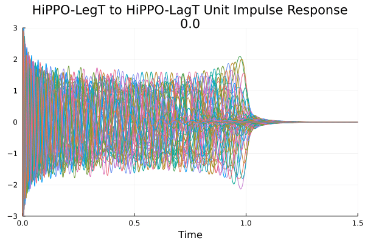
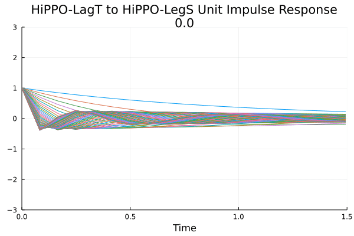

# Julia Notebooks

Im using julia here to quickly look at and experiment with HiPPO, S4, S4D and any other models that are applicable. I will be putting these visualizations here and detailed instructions as to how to setup julia and notebooks using julia along with the gifs that are created.

## HiPPO

### LegT Measure

The LegT measure assigns uniform weight to the most recent history

**When $\lambda_{n} = 1$**

**Time Measure:**

$$
\begin{align}
\mu^{(t)}(x) = \frac{1}{\theta}\mathbb{I}_{[t-\theta, t]}(x)
\end{align}
$$

**HiPPO-LegT Operator:**

$$
\begin{align}
\frac{d}{dt} c(t) &= -\frac{1}{\theta}Ac(t) + \frac{1}{\theta}Bf(t)
\end{align}
$$

where

$$
\begin{align}
A_{nk} &= (2n+1)^{\frac{1}{2}}(2k+1)^{\frac{1}{2}} \cdot
\begin{cases}
1 & \text{if } n \geq k  \\
(-1)^{n-k} & \text{if } n \leq k
\end{cases} \\
B_{n} &= (2n+1)
\end{align}
$$

**When $\lambda_{n} = (2n+1)^{\frac{1}{2}}(-1)^{n}$, which is equivalent to an LMU (Legendre Memory Unit).**

**Time Measure:**

$$
\begin{align}
\mu^{(t)}(x) = \frac{1}{\theta}\mathbb{I}_{[t-\theta, t]}(x)
\end{align}
$$

**HiPPO-LegT Operator:**

$$
\begin{align}
\frac{d}{dt} c(t) &= -\frac{1}{\theta}Ac(t) + \frac{1}{\theta}Bf(t)
\end{align}
$$

where

$$
\begin{align}
A_{nk} &= (2n+1) \cdot
\begin{cases}
(-1)^{n-k} & \text{if } n \geq k  \\
1 & \text{if } n \leq k
\end{cases} \\
B_{n} &= (2n+1)(-1)^{n}
\end{align}
$$

### LagT Measure

The LagT measure instead use the exponentially decaying measure, assigning more importance to recent history

**Time Measure:**

$$
\begin{align}
\mu^{(t)}(x) &= e^{-(t-x)}\mathbb{I}[-\infty, t](x) =
\begin{cases}
e^{x-t} & \text{ if } x \leq t  \\
0 & \text{ if } x > t
\end{cases}
\end{align}
$$

**HiPPO-LagT Operator:**

$$
\begin{align}
\frac{d}{dt}c(t) &= - \frac{1}{t} Ac(t) + \frac{1}{t} Bf(t)
\end{align}
$$

where

$$
\begin{align}
A_{nk} &=
\begin{cases}
1 & \text{if } n \geq k  \\
0 & \text{if } n < k  \\
\end{cases} \\
B_{n} &= 1
\end{align}
$$

### LegS Measure

The LegS measure assigns equal importance over the cumulative history

**Time Measure:**

$$
\begin{align}
\mu^{(t)} &= \frac{1}{t}\mathbb{I}_{[0, t]}
\end{align}
$$

**HiPPO-LegS Operator:**

(Continous)

$$
\begin{align}
\frac{d}{dt}c(t) &= - \frac{1}{t} Ac(t) + \frac{1}{t} Bf(t)
\end{align}
$$

(Discrete)

$$
\begin{align}
c_{k+1} &= (1-\frac{A}{k})c_{k}+\frac{1}{k}Bf_{k}
\end{align}
$$

where

$$
\begin{align}
A_{nk} &= (2n+1)^{\frac{1}{2}}(2k+1)^{\frac{1}{2}}
\begin{cases}
1 & \text{if } n > k  \\
n+1 & \text{if } n = k  \\
0 & \text{if } n < k
\end{cases} \\
B_{n} &= (2n+1)^{\frac{1}{2}}
\end{align}
$$

### Fourier Basis

#### Fourier Recurrent Unit Measure

#### Truncated Fourier Measure

**Time Measure:**

$$
\begin{align}
\mu^{(t)}(x) &= \mathbb{I}{[0, 1]}(x)
\end{align}
$$

**HiPPO-FouT Operator:**

$$
\begin{align}
\frac{d}{dt}c(t) &= - \frac{1}{t} Ac(t) + \frac{1}{t} Bf(t)
\end{align}
$$

where

$$
\begin{align}
A_{nk} &=
\begin{cases}
-2 & \text{if } n = k = 0  \\
-2\sqrt{2} & \text{if } n = 0, k \text{ odd}  \\
-2\sqrt{2} & \text{if } k = 0, n \text{ odd}  \\
-4 & \text{if } n, k \text{ odd}  \\
2\pi n & \text{if } n - k = 1, k \text{ odd}  \\
-2\pi k & \text{if } k - n = 1, n \text{ odd}  \\
0 & \text{otherwise}  \\
\end{cases} \\
B_{n} &=
\begin{cases}
2 & \text{if } n = 0  \\
2\sqrt{2} & \text{if } n \text{ odd}  \\
0 & \text{if } \text{otherwise}  \\
\end{cases} \\
\end{align}
$$

#### Decaying Fourier Measure

### Other GIFs

#### Interpolation

##### HiPPO-LegS to HiPPO-LegT Unit Impulse Response

##### HiPPO-LegS to HiPPO-LagT Unit Impulse Response

##### HiPPO-LegT to HiPPO-LegS Unit Impulse Response

##### HiPPO-LegT to HiPPO-LagT Unit Impulse Response

##### HiPPO-LagT to HiPPO-LegT Unit Impulse Response

##### HiPPO-LagT to HiPPO-LegS Unit Impulse Response

